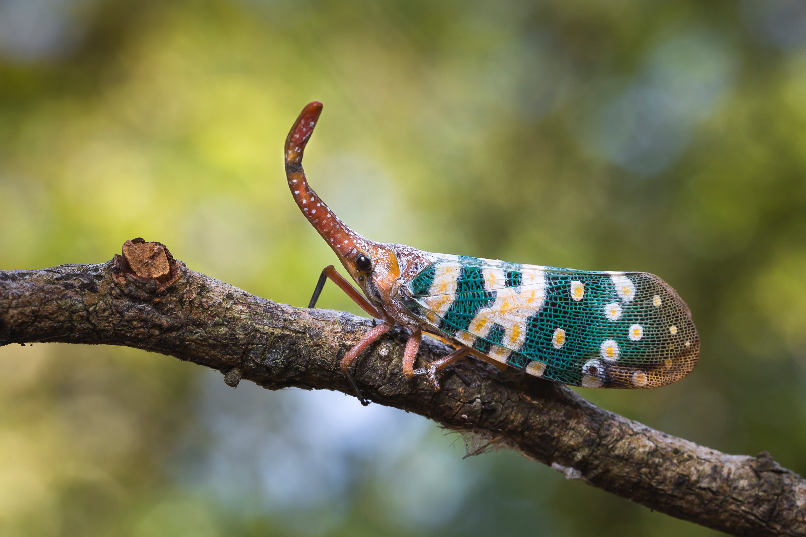
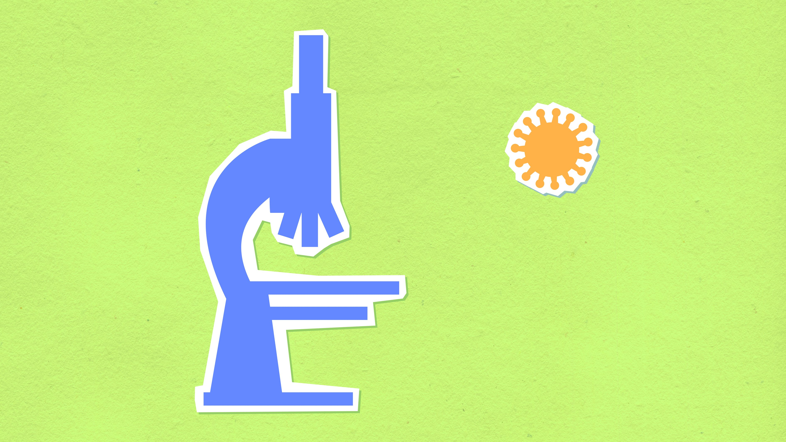
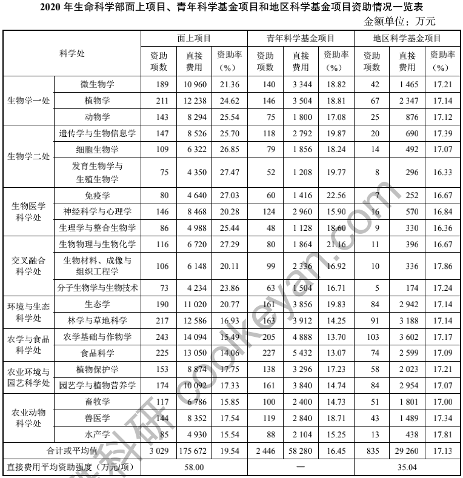
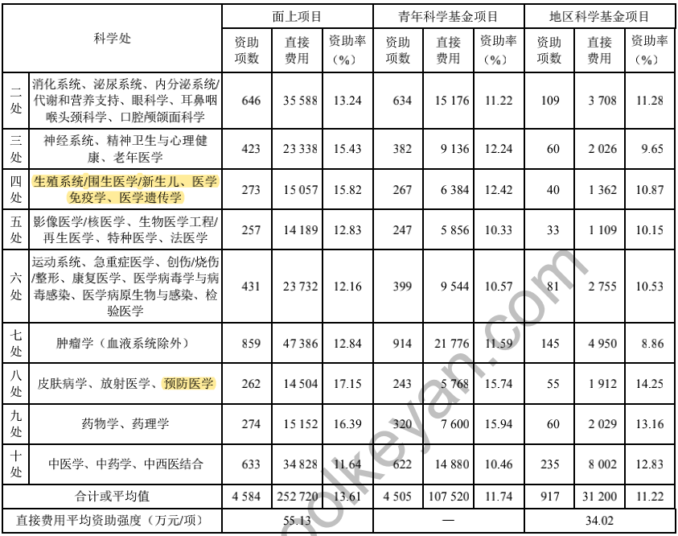
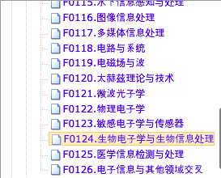
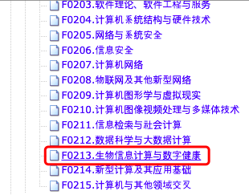
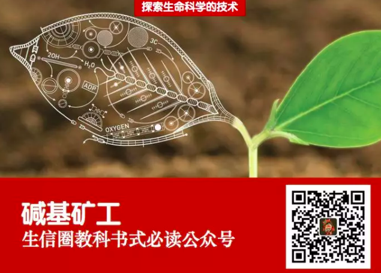

# 碱基周报（第 001 期）：国家自然科学基金申请

记录每周值得分享的生命科学和生物信息学进展内容，周日发布。

## 封面图

## 本周话题：国家自然科学基金申请

这周在国内学术圈最重要的一个事情就是**国家自然科学基金**（简称：国自然）的申请，每年都要三月份中旬提交。通常都要花很长时间写好项目标书，所以几乎每个有意申请的科研人员都很难过好春节，而且每年如此。国自然对于每个科研人员来讲意义都很大，它就像是科研人员的高考，特别是对于进入科研圈的新人来说更是如此，它是一个标志，而且竞争激烈，这是去年生命科学部中标率（资助率）的一个统计：

这一个是去年医学科学部中标率的统计：

相对来说，生命科学部比起医学科学部的中标率还是要高不少的（大约高6%-7%）。

另外，我发现在信息科学部下面其实也有两个生物信息学的分支，这并意外，因为生物信息学其实也是一门信息科学。

## 文章和资讯

1、

-----

每周首发于个人公众号：**helixminer（碱基矿工）**

